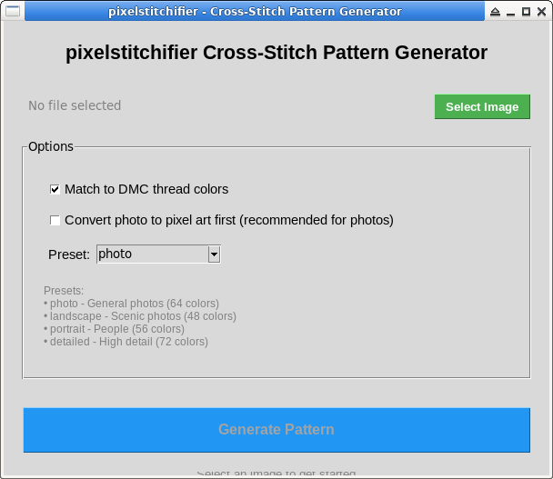

# pixelstitchifier

> *For Andrea because she makes my heart sing*
---

## Turn Your Photos Into Cross-Stitch Patterns

Have a photo you'd love to stitch? pixelstitchifier transforms any image into a professional cross-stitch pattern with real DMC thread colors. Just load your image, click a button, and start stitching!

Perfect for stitching photos of loved ones, pets, landscapes, or any image that means something to you.

---

## 📥 Download for Windows

**No technical knowledge required!** Just download and double-click:

### 👉 **[Download pixelstitchifier (Windows)](../../releases/latest)** 👈

1. Click the link above
2. Download `pixelstitchifier-gui.exe`
3. Double-click to open
4. Select your photo
5. Click "Generate Pattern"
6. Start stitching!

**That's it!** Your pattern will be saved right next to your original image.

> **Note:** Windows might show a security warning on first run. Click "More info" → "Run anyway". This is normal for new applications that aren't code-signed (which costs $$$ we don't have!).

---

## 🎨 How to Use (GUI Version)

The graphical interface makes it super simple to create patterns:



### What Each Option Does:

- **Match to DMC thread colors** ✅ *(Recommended)*  
  Automatically converts your image colors to real DMC embroidery thread colors (all 454 of them!). Your pattern will tell you exactly which thread to buy.

- **Convert photo to pixel art first** 🎨 *(Recommended for photos)*  
  Turns regular photos into beautiful pixel art before making the pattern. This makes photos actually stitchable! Skip this if you're already starting with pixel art.

- **Presets** 🎯  
  Different images need different treatment:
  - **photo** - General photos (family, pets, etc.)
  - **landscape** - Outdoor scenes with lots of color
  - **portrait** - People and faces (gentler processing)
  - **detailed** - Intricate images that need fine details

### Your Results:

After clicking "Generate Pattern", you'll get:

1. **`yourimage_pattern.png`** - Your cross-stitch pattern with:
   - Grid lines for easy counting
   - Symbols (A-Z) for each color
   - A legend showing which DMC thread each symbol needs
   - Stitch counts for each color

2. **`yourimage_pixelated.png`** *(if you used "convert to pixel art")*  
   The intermediate pixel art version, in case you want to see what it looks like before stitching

---

---

## 💻 For Developers & Command Line Users

If you're comfortable with the terminal or want to integrate pixelstitchifier into your own projects, you can use the command line version or Python library.

<details>
<summary><strong>Click to expand command line instructions</strong></summary>

### Installation

**Requirements:**
- Python 3.8 or newer
- pip (Python package manager)

**Install:**

```bash
# Clone the repository
git clone https://github.com/treeherder/pixelstitchifier.git
cd pixelstitchifier

# Install dependencies
pip install -r requirements-dev.txt
```

### Command Line Usage

**Basic usage:**

```bash
# Simple: DMC matching enabled by default
python3 pixelstitchifier your_image.png

# For photos: Convert to pixel art first
python3 pixelstitchifier photo.jpg --pixelate --preset photo

# Choose a preset for your image type
python3 pixelstitchifier landscape.jpg --pixelate --preset landscape
python3 pixelstitchifier portrait.jpg --pixelate --preset portrait
```

**All options:**

```bash
python3 pixelstitchifier IMAGE [OPTIONS]

Options:
  --pixelate           Convert photo to pixel art before making pattern
  --preset PRESET      Quality preset: photo, landscape, portrait, detailed
  --width WIDTH        Pixel art width in stitches (default: varies by preset)
  --no-dmc            Use original colors instead of DMC thread colors
  --help              Show help message
```

### Using as a Python Library

```python
from src.pixelstitchifier.converter import PixelstitchifierConverter

# Create converter with DMC matching (default)
converter = PixelstitchifierConverter(
    use_dmc=True,           # Match to DMC threads
    pixelate=True,          # Convert photos to pixel art
    art_preset='photo'      # Quality preset
)

# Generate pattern
output_path = converter.convert("my_photo.jpg")
print(f"Pattern saved to: {output_path}")
```

See [ARCHITECTURE.md](ARCHITECTURE.md) for developer documentation.

</details>

---

## 🎯 What Makes This Different

This project started from [Noëlle Anthony](https://github.com/NoelleDL)'s original [`stitchify`](https://github.com/NoelleDL/stitchify) - a simple tool that converted pixel art into cross-stitch patterns. That was perfect for video game sprites and simple graphics!

But what if you wanted to stitch a photo of your family, your pet, or a beautiful landscape? That's where this fork comes in.

### This Version Adds:

- 🖼️ **Photo-to-Pixel-Art Conversion** - Real photos become stitchable pixel art with intelligent processing
- 🧵 **DMC Thread Matching** - All 454 official DMC embroidery thread colors, automatically matched
- 🎨 **Quality Presets** - Different settings optimized for photos, landscapes, portraits, and detailed images
- 🖱️ **GUI Application** - No command line needed! Point, click, stitch
- 📦 **Windows Executable** - No Python installation required
- 🎭 **Advanced Image Processing** - Edge-preserving filters, smart color clustering, dithering
- ✅ **Comprehensive Testing** - Professional software engineering practices (61% test coverage and growing!)

### The Original Vision:

Noëlle's original README said:
> *"TODO: Correspond hex colors to floss colors, where possible. (Maybe) add GUI."*

Well, mission accomplished! And then some. 💪

This fork took the core concept and built it into a tool that anyone can use to turn their cherished photos into cross-stitch patterns. The code has been completely rewritten with a modular architecture, extensive testing, and professional software engineering practices.

**Thank you, Noëlle, for the inspiration and the foundation!** 🙏

---

## 📚 Technical Details

<details>
<summary><strong>For the technically curious...</strong></summary>

### What's Under the Hood:

**Architecture:**
- Modular, testable design with clear separation of concerns
- Comprehensive test suite (pytest) with 61% coverage
- Type hints throughout the codebase
- Deterministic output (same input always produces same result)

**Image Processing Pipeline:**
1. **Load & Validate** - Check image format and accessibility
2. **Pixelate** *(optional)* - Multi-stage conversion:
   - Bilateral filtering to smooth while preserving edges
   - Smart color quantization with K-means clustering
   - Preset-specific adjustments (saturation, contrast, etc.)
3. **DMC Matching** *(optional)* - Map to 454 real DMC thread colors using PIL's adaptive algorithm
4. **Symbol Assignment** - Map each color to a unique symbol (A-Z, a-z)
5. **Pattern Generation** - Create grid with symbols, legend, and stitch counts

**Dependencies:**
- `Pillow (PIL)` - Core image processing
- `opencv-python` - Advanced filtering (bilateral filter)
- `scikit-learn` - K-means color clustering
- `pytest` - Testing framework

**Code Structure:**
```
src/pixelstitchifier/
├── __init__.py              Package exports
├── image_loader.py          Image loading and validation
├── color_processor.py       Color quantization and filtering  
├── symbol_mapper.py         Symbol-to-color mapping
├── pattern_generator.py     Pattern image with grid and legend
├── dmc_matcher.py           DMC thread color matching
├── art_converter.py         Photo-to-pixel-art conversion
├── thread_database.py       DMC color database (454 colors)
└── converter.py             Main orchestrator
```

See [ARCHITECTURE.md](ARCHITECTURE.md) and [tests/README.md](tests/README.md) for more details.

</details>

---

## 🤝 Contributing

Found a bug? Have an idea? Pull requests welcome!

For major changes, please open an issue first to discuss what you'd like to change.

**Current priorities:**
- Increasing test coverage toward 80%
- More quality presets for different image types
- Better documentation with examples
- Performance optimizations for large images

---

## 📄 License & Credits

**Original Project:** [`stitchify`](https://github.com/NoelleDL/stitchify) by Noëlle Anthony  
**This Fork:** Extensively modified and enhanced by [treeherder](https://github.com/treeherder)

The core concept of "pixel art → cross-stitch pattern" comes from Noëlle's original work. This fork has taken that concept in a completely different direction with photo conversion, DMC matching, GUI, and professional software engineering practices.

*[Add your license information here]*

---

## 💖 Made With Love

This project exists because someone special deserves beautiful, handmade gifts. May your stitching bring as much joy as the photos that inspire your patterns.

Happy stitching! 🧵✨

### How It Works

Two-stage intelligent quantization:

1. **Adaptive Analysis**: Analyzes your image to find the most important colors
2. **DMC Palette Mapping**: Maps those colors to nearest DMC threads from 454-color database
3. **Dithering**: Floyd-Steinberg dithering smooths transitions between colors

### Example

```bash
# Input: Photo with 12,213 colors - DMC matching automatic!
python3 pixelstitchifier sunset_photo.png

# Output: 17 optimal DMC thread colors
# DMC-352 Coral Light (10,397 stitches)
# DMC-3712 Salmon Medium (3,572 stitches)  
# DMC-309 Rose Dark (2,817 stitches)
# ... + 14 more carefully selected colors
```

### Programmatic Usage

```python
from pixelstitchifier import PixelstitchifierConverter

converter = PixelstitchifierConverter(use_dmc=True)
converter.convert("pixel_art.png")
```

### DMC Database

Uses the comprehensive [sharlagelfand/dmc](https://github.com/sharlagelfand/dmc) database:
- 454 authentic DMC thread colors
- Accurate RGB values from official DMC charts
- Color names and thread numbers

The generated pattern legend will include:
- DMC thread number (e.g., DMC-310)
- Thread color name (e.g., "Black")
- Hex color code
- Stitch count

## Photo to Pixel Art Conversion

Transform photos into high-quality cross-stitch patterns with professional pixel art conversion!

### Multi-Stage Pipeline

When using `--pixelate`, your photo goes through a sophisticated 5-stage process:

1. **Bilateral Filtering** - Edge-preserving smoothing that flattens colors while keeping sharp boundaries
2. **High-Quality Resize** - Lanczos interpolation for superior downsampling
3. **K-means Clustering** - Intelligent color grouping for cleaner regions
4. **Edge Enhancement** - Selective sharpening of important features
5. **Color Adjustment** - Saturation and contrast boost for vibrant stitching

### How It Works

```python
# Before: Photo with thousands of colors
# After:  Clean pixel art with 20-30 DMC thread colors

photo.jpg (1920x1080, 45,000 colors)
    ↓ --pixelate
pixel_art (128x72, 25 colors)
    ↓ automatic DMC quantization
pattern (25 DMC threads, ready to stitch!)
```

### Quality Presets

Different image types need different processing:

- **photo**: Balanced settings for general photography
  - Moderate bilateral filtering (d=9)
  - Edge enhancement: 30%
  - 64 intermediate colors via K-means
  
- **landscape**: Enhanced for outdoor scenes
  - Stronger saturation boost (1.2x)
  - Higher contrast (1.15x)
  - 48 intermediate colors
  
- **portrait**: Gentle processing for faces
  - Stronger bilateral smoothing (d=11)
  - Reduced edge enhancement (20%)
  - Preserves skin tones
  
- **detailed**: Maximum detail preservation
  - Minimal bilateral (d=5)
  - Strong edge enhancement (70%)
  - 72 intermediate colors

### Programmatic Usage

```python
from pixelstitchifier import ArtConverter, PixelstitchifierConverter

# Method 1: Convert photo to pixel art, then to pattern
converter = ArtConverter(target_width=128, preset='landscape')
pixel_art = converter.convert('photo.jpg')
pixel_art.save('pixel_art.png')

# Method 2: One-step conversion
converter = PixelstitchifierConverter(
    use_dmc=True,
    pixelate=True,
    pixelate_width=128,
    art_preset='portrait'
)
converter.convert('photo.jpg', 'pattern.png')

# Method 3: Convenience function
from pixelstitchifier import convert_to_pixel_art
pixel_art = convert_to_pixel_art('photo.jpg', width=128, preset='photo')
```

### Technical Details

**Bilateral Filter**: σ_color = 75, σ_space = 75
- Gaussian kernel that weights pixels by spatial proximity AND color similarity
- Smooths flat areas while preserving edges
- Essential for clean pixel art aesthetic

**K-means Clustering**: n_clusters = 48-72 (preset dependent)
- Groups perceptually similar colors before DMC quantization
- Creates cleaner color regions for better stitching
- Reduces visual noise from compression artifacts

**Floyd-Steinberg Dithering**: Error diffusion to adjacent pixels
- Creates illusion of intermediate colors
- Maintains perceived accuracy when quantizing to DMC palette
- Standard in professional pixel art tools

### Thread Database Integration

For comprehensive DMC color data (400+ colors), install `thread-database`:

```bash
pip install thread-database  # (when available)
```

pixelstitchifier will automatically use it if installed, or fall back to a bundled minimal set.

## Backwards Compatibility

The original `pixelstitchifier.py` remains available for backwards compatibility. New development uses the modular architecture in `src/pixelstitchifier/`.

## Roadmap

- [x] Accept image name on command line
- [x] Create image from symbolized pixels
- [x] Add grid lines and edge labels to image
- [x] Add legend with stitch counts
- [x] **Correspond hex colors to DMC floss colors** ✨ NEW
- [x] **Modular architecture with comprehensive tests** ✨ NEW
- [ ] Change characters to extended symbols for readability
- [ ] Expand symbol set beyond 52 characters
- [ ] Add edge labels with stitch numbers
- [ ] GUI interface
- [ ] Support for other thread brands (Anchor, J&P Coats)
- [ ] Color reduction/palette optimization
- [ ] Custom color palettes

## How It Works

1. **ImageLoader** loads the pixel art image and converts to RGBA
2. **ColorProcessor** extracts unique colors and filters transparency
3. **SymbolMapper** assigns symbols (A-Z, a-z) to each unique color
4. **DMCMatcher** (optional) finds nearest DMC thread colors
5. **PatternGenerator** creates the output pattern:
   - Draws grid with major (every 10 stitches) and minor lines
   - Places symbols at each stitch position
   - Adds formatted legend with color info and stitch counts

## Contributing

This project now follows Test-Driven Development (TDD):

1. Write tests for new features first
2. Implement features to pass tests
3. Refactor while keeping tests green
4. Maintain >90% code coverage

## Author

Noëlle Anthony

## License

See LICENSE file for details.
